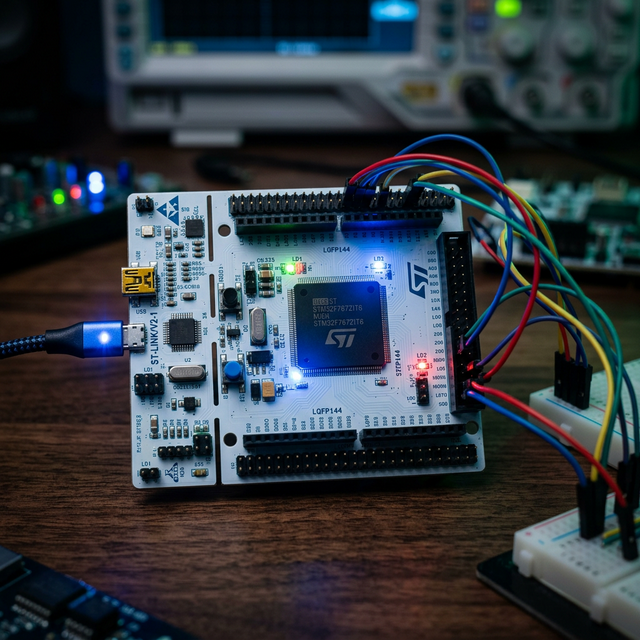

# ⚡ Week 1: Awakening the Silicon
## 📅 Period: xx/xx — xx/xx



> "In the world of bare-metal, there are no abstractions—only you, the datasheet, and the electrons."

Welcome to **Week 1**. This isn't just a coding week; it's a deep dive into the physical reality of computing. We're moving beyond "running code" to **manipulating 32-bit memory cells** with surgical precision. 

---

### 🎯 The Mission Briefing
This week is the foundation of **Phase I (Software & Silicon Engineering)**. If you don't know how the compiler organizes SRAM, you're just guessing. We stop guessing now.

*   **The Challenge:** Master **data anatomy** and the **linear memory map** of the STM32F413ZH [RM0430, 2.2].
*   **The Weaponry:** Zero external libraries. Just raw pointers, bit-level operations, and pure hardware control.
*   **The Artifact:** By Sunday, you'll have built a **Physical Carry Calculator**—a system that detects logical overflows and signals them via hardware LEDs, all validated by a professional TDD workflow.

---

### 🏆 The Grand Goal: "The LED Carry Calculator"
Forget `printf`. Your hardware is your interface.
1.  **Data Bus:** Use 8 external LEDs to display truncated results.
2.  **Alert System:** **LED3 (Red - PB14)** triggers on **Integer Overflow**.
3.  **The Bare-Metal Oath:** No `HAL_GPIO_Write()`. You will strike the registers directly via `RCC_AHB1ENR`, `GPIOx_MODER`, and `GPIOx_ODR` using raw memory addresses.

---

### 🗺️ Mission Roadmap

| Phase | Milestone | Objective |
| :--- | :--- | :--- |
| **Mon** | **The Iron Rule** | Zero warnings tolerated (`-Werror`) & `stdint.h` mastery. |
| **Tue** | **Silicon Cartography** | Map the SRAM/Flash wilderness [RM0430, 2.2]. |
| **Wed** | **Bitwise Surgery** | Craft the macros that manipulate the machine. |
| **Thu** | **Memory Hacking** | Master `volatile` to keep the compiler in check. |
| **Fri** | **The Awakening** | First flight on real hardware (LED Calculator). |
| **Sat** | **Logic Forge (TDD)** | Prove your code works with Ceedling/Unity. |
| **Sun** | **The Clean Slate** | Shutsuke: Refactor for absolute clarity. |

---

### 🔬 Daily Manual: Step-by-Step

#### 🟢 Monday: The Discipline of Types
*   **The Standard:** Update your `CMakeLists.txt` with `-Wall -Wextra -Werror`. If it warns, it fails.
*   **Action:** Build `printTypeSizes()` to audit `uint8_t`, `uint16_t`, `uint32_t`, and `float`. 
*   **Goal:** 100% clean compilation. No excuses.

#### 🔵 Tuesday: Cartography of the STM32
*   **The Recon:** Open the **RM0430** manual. Find **Table 1**.
*   **Action:** Locate SRAM1 (`0x2000 0000`) and print addresses of `static` (RAM) vs local (Stack) variables.
*   **Insight:** See the distance between your data and your stack.

#### 🟡 Wednesday: Surgical Bit Operations
*   **The Kit:** Build your own `SET_BIT`, `CLEAR_BIT`, and `TOGGLE_BIT`.
*   **Philosophy:** "Do one thing well": Separate math from visualization.

#### 🔴 Thursday: The `volatile` Guardian
*   **The Target:** `GPIOB_ODR` register at `0x4002 0414`.
*   **The Code:** `volatile uint32_t *pODR = (uint32_t *)0x40020414;`.
*   **Why?** Without `volatile`, the compiler thinks your LED writes are "useless" and deletes them. Don't let it.

#### 🔌 Friday: Hardware Bring-Up
*   **Power On:** Enable the GPIOB clock in `RCC_AHB1ENR`. 
*   **The Logic:** `if (result < opA) { *pODR |= (1 << 14); }` — Real-world overflow detection.

#### 🧪 Saturday: The TDD Gauntlet
*   **Process:** Red-Green-Refactor. 
*   **Rigor:** One Assert per test. If it's worth writing, it's worth testing.

#### 🧹 Sunday: Shutsuke (Self-Discipline)
*   **The Scout Rule:** Leave the code cleaner than you found it. 
*   **The Newspaper Layout:** High-level logic at the top, register-level details at the bottom.

---

### 📂 Knowledge Base
*Need a deep dive? Check the daily field notes:*

| Day | Topic | Deep Dive |
| :--- | :--- | :--- |
| **Day 1** | Types & Assertions | [day1_type_sizes.md](./docs/day1_type_sizes.md) |

---

### 🛠️ Quick Start Commands

#### 1. The Forge (Build)
*   **Standard:** Hit **Build** in VS Code status bar.
*   **Terminal:** `cmake --build build`

#### 2. The Deployment (Flash)
*   **Standard:** `Ctrl + Shift + P` ⮕ `Tasks: Run Task` ⮕ **Flash device**.
*   **Terminal:** 
    ```bash
    openocd -f interface/stlink.cfg -f target/stm32f4x.cfg -c "program build/Nucleo_F413_Template.elf verify reset exit"
    ```

---
*Back to [STM32 Modules](../README.md)*
